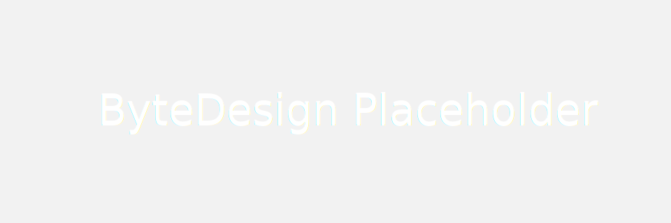
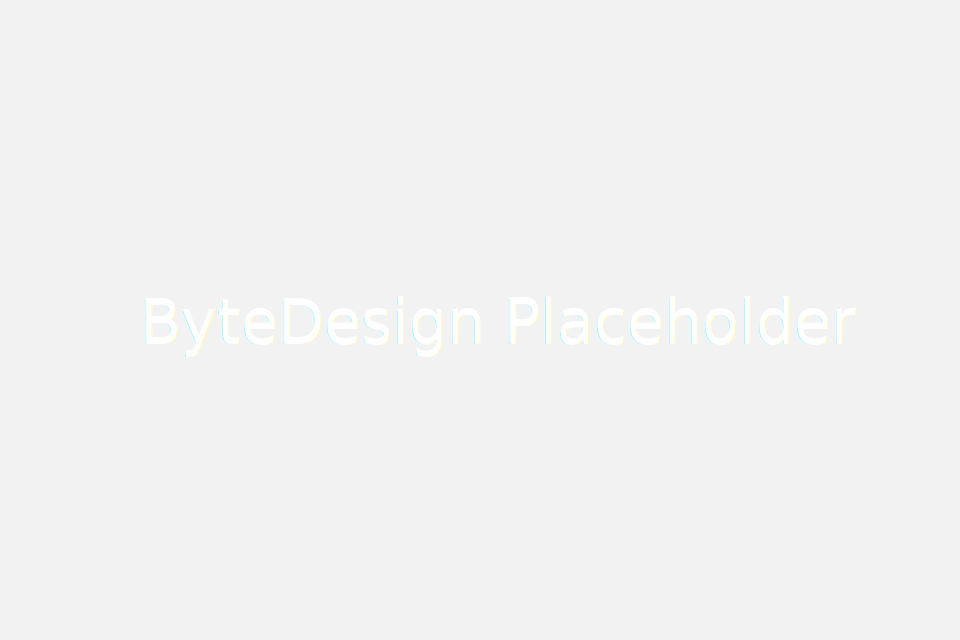

Use buttons to trigger actions and links. Buttons can contain a combination of a clear label and an icon while links are always text.

  

## 按钮类型

在 ByteDesign 中根据应用场景的差异，按钮主要有以下三种展示类型 `主题按钮`、`次要按钮`、`灵魂按钮`，其主题颜色可以参见 [颜色系统](../../visual/color.html) 。

### 主题按钮

常用于强调主次关系的场景，表现为主要功能的提示，多按钮之间中重要凸显；主题按钮不能过度频繁使用，以避免功能主次关系混乱。

>不成熟的小建议：单一页面内主题按钮数量少于4个；

### 普通按钮

相比主题按钮，普通按钮用于场景最为广泛，除主题强调场景外的大多数功能操作都可以使用普通按钮。通常多个普通按钮和主题按钮一起搭配使用。

### 灵魂按钮

常用于复杂界面和空间有限的业务场景，可以很好的避免大量功能操作并存引起的界面碎片化和复杂化。

## 按钮状态

在不同使用场景和交互逻辑下，按钮会呈现不同的状态效果，以便更好的引导用户进行正确的交互操作。根据使用频率的高低按钮会有以下6种状态。

默认态 regular
悬浮态 hover
按下态 pressed
无效态 disable
激活态 active
报错态 error

## 按钮尺寸

按钮及 ByteDesign 中其他基础组件类的尺寸分为 5 类，`更小`、`小`、`默认`、`大`、`更大`，按钮尺寸高度之间按照 `4px` 递增递减。

### 高度

默认尺寸高度为：34px
小尺寸高度为：30px
更小尺寸高度为：26px
大尺寸高度为：38px
更大尺寸高度为：42px

> 34px 是 ByteDesign 控件高度的基准高度，在产品中呈现均基于基准高度进行变化。

### 宽度

固定宽度，根据尺寸初始设定固定宽度，内容在有效范围内按钮尺寸都不会变化。

适应宽度，更具按钮内容，自适应调整宽度，内容距离左右边距固定为 `12px`;

> 实际情况下，按钮内容再有效范围内时，采用固定宽度，超出有效范围采用适应宽度的方式。

容器宽度，按钮的宽度取决于当前按钮所在页面或者区域容器的宽度；Web 使用较少，多为移动端场景使用。

## 场景说明

### 按钮组

### 图标文字按钮

### 图标按钮

### 动态按钮

### 下拉按钮

Trigger menus with a set of related actions

## 设计标注



<iframe src="http://design.bytedance.net/output/bux/#artboard1" style="border:none;" height="600" width="100%"></iframe>


