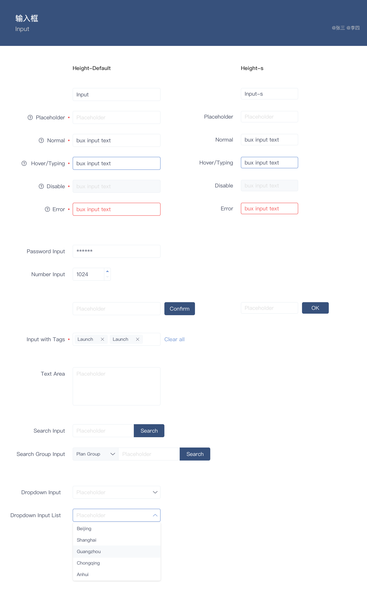

The TextField component enables a user to type text into an app. It's typically used to capture a single line of text, but can be configured to capture multiple lines of text. The text displays on the screen in a simple, uniform format.

  

## 输入类型

文字输入框

数字输入框
- 递增按钮
- 拖拽变数

密码输入框
- 密码明示/不明示

日期输入框

搜索输入框
- 关键词清除图标

## 输入状态

默认态 regular
悬浮态 hover
输入态 inputing
无效态 disable
激活态 active
焦点态 focused
报错态 error
- 错误提示文字

输入长度过长

占位符 Placeholder

必填项

## 输入大小

## 高度

输入框高度依据按钮基准高度原则；

默认尺寸高度为：34px
小尺寸高度为：30px
更小尺寸高度为：26px
大尺寸高度为：38px
更大尺寸高度为：42px

### 宽度

输入宽度根据输入框的场景而定，但是默认宽度建议不小于 `100px`;

## 多行输入框

纵向滚动条

可变大小

## 衍生场景

### 输入记数

### 按钮和输入框组合

### 前缀和后缀

### 图标输入框的结合

### label+输入框

### 多输入框组合

### 输入框联想选择

