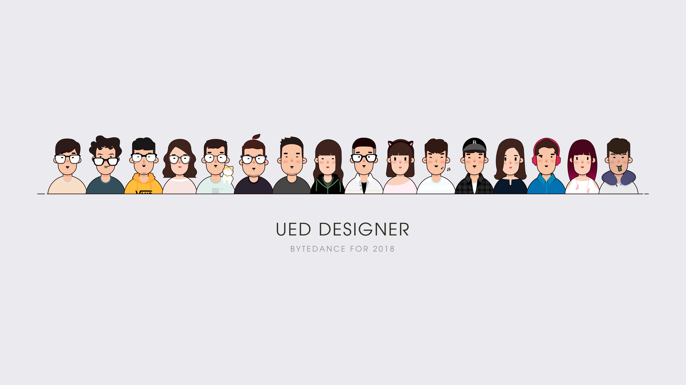

设计规范文档均采用 MarkDown 格式进行撰写，在参与编辑之前请先熟悉 MarkDown 的基础语法。



  

    
  

  

  北京字节跳动科技有限公司成立于2012年3月，是最早把人工智能技术大规模应用于信息分发的公司之一。添加链接[我是链接](#)，加粗 **我是加粗的** 效果，斜体效果  _italic_ ，中文不建议使用斜体，添加小标签 `我是小标签` 的效果；
  没有间隔的第二段，我们的愿景是要做“全球创作与交流平台”
  


