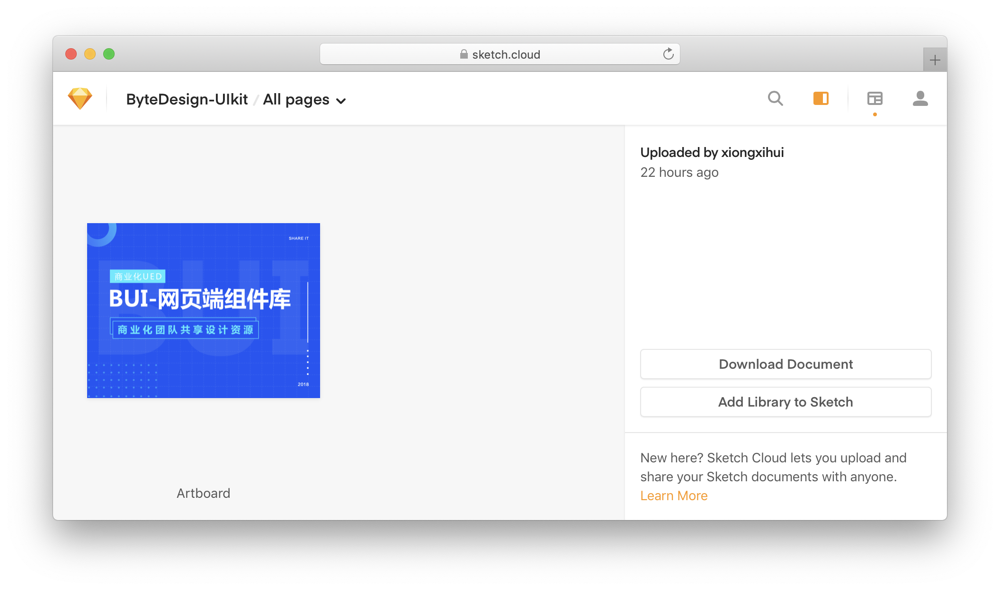
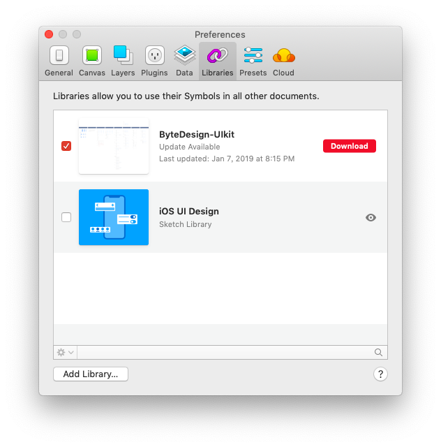

  

阅读以下内容将会使设计师便捷获取更新 ByteDesign UIKit 。

## 获取 UIKit 库文件

点击进入 ByteDesign UIKit 库下载界面从 Sketch Cloud 获取 UIKit v0.1 Alpha 版本。

<a class="button" href="https://sketch.cloud/s/ggoqa">获取 UIKit Alpha</a> - or - <a id="modal-player" class="button" href="uikit-tutorial.html">视频教程</a>

Sketch Cloud 地址：`https://sketch.cloud/s/ggoqa`

点击“Add Library to Sketch” 浏览器会自动提示打开 Sketch 并自动下载库文件到本地 Sketch 库；并保持云端库文件的更新；

按照提示操作后，Sketch Library 中将会出现相应的库文件，并且该库文件是可以进行云端更新，可以获取最新的 ByteDesign UIKit 库文件；

## 更新 UIKit 库文件

如果云端库文件有更新，在设置界面中将会出现`Download`提示，点击后即可将库文件更新至最新。

每次更新可以对比前后差异决定是否将更新应用于本地文件，参见 [官网 Sketch Docs](https://www.sketchapp.com/docs/libraries/library-updates)

## 下载 UIKit Sketch 源文件

如果需要进行源文件下载进行参考，则点击`Download Document`按钮进行源文件下载，

> 注意如果下载后使用，将失去云端更新能力，只能每次单独进行文件下载使用。

## 延伸阅读附录

如果你对 Sketch 还有些陌生，请先阅读初步学习后会更容易上手。
[Sketch Library Updates](https://www.sketchapp.com/docs/libraries/library-updates)
[Sketch Cloud](https://www.sketchapp.com/docs/sketch-cloud/)
